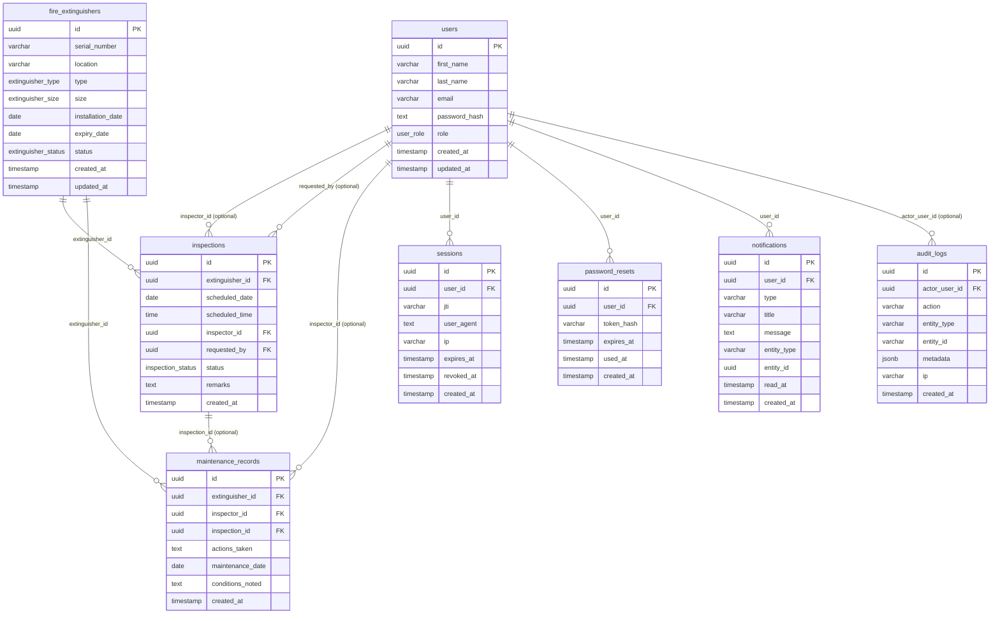
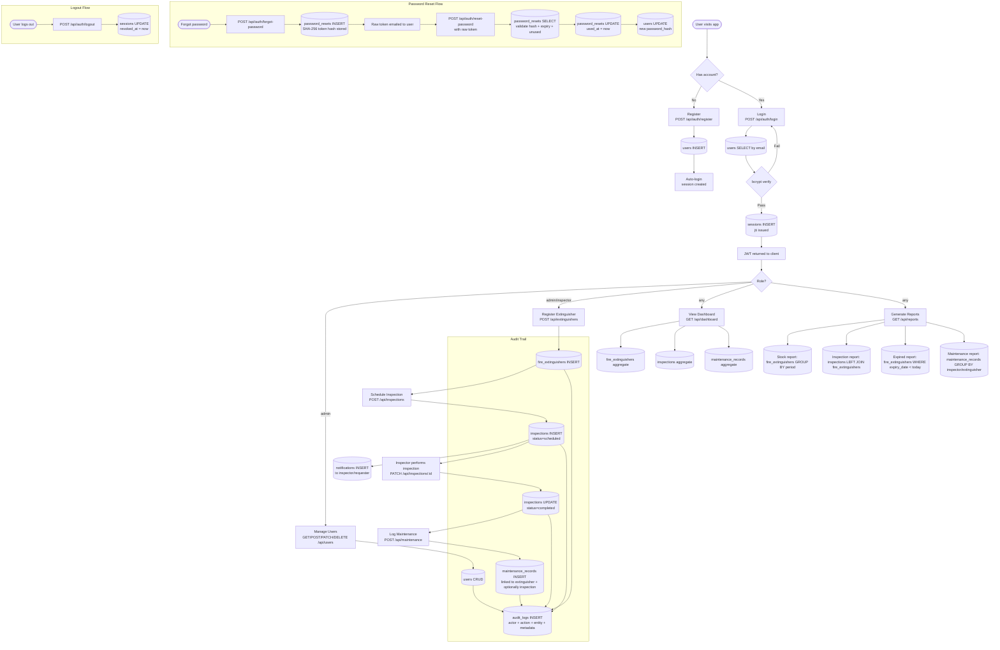

# FEMS Database Design

## Overview

The Fire Extinguisher Management System (FEMS) uses a PostgreSQL database (hosted on Supabase) accessed via Drizzle ORM with the `postgres-js` driver. The data model is organised around a modular-monolith architecture where each logical domain — user management, fire extinguisher inventory, inspection scheduling, maintenance tracking, session/auth, and notifications — maps to a dedicated table with clear foreign-key boundaries. All primary keys are UUIDs, all timestamps carry timezone information, and no soft-delete pattern is used (rows are physically deleted with cascade rules handling referential integrity).

---

## Entity-Relationship Diagram

---

## Enums & Domains

### `user_role`
| Value | Description |
|---|---|
| `admin` | Full system access; can manage users, all data, and reports |
| `inspector` | Can perform inspections and log maintenance |
| `user` | Read access; can request inspections |

### `extinguisher_type`
| Value | Description |
|---|---|
| `water` | Water-based extinguisher |
| `co2` | Carbon dioxide extinguisher |
| `foam` | Foam extinguisher |
| `dry_chemical` | Dry chemical powder extinguisher |

### `extinguisher_size`
| Value |
|---|
| `2.5 lbs` |
| `5 lbs` |
| `9 lbs` |
| `12 lbs` |

### `extinguisher_status`
| Value | Description |
|---|---|
| `active` | In service, no issues |
| `under_maintenance` | Temporarily taken out of service for maintenance |
| `expired` | Past expiry date or manually marked expired |
| `decommissioned` | Permanently retired |

### `inspection_status`
| Value | Description |
|---|---|
| `scheduled` | Upcoming inspection |
| `completed` | Inspection was carried out |
| `overdue` | Past scheduled date and not completed |
| `cancelled` | Inspection was cancelled |

---

## Table Reference

### `users`

Central identity table. Holds all system actors regardless of role.

| Column | Type | Constraints | Default | Notes |
|---|---|---|---|---|
| `id` | `uuid` | PK | `gen_random_uuid()` | |
| `first_name` | `varchar(100)` | NOT NULL | | |
| `last_name` | `varchar(100)` | NOT NULL | | |
| `email` | `varchar(255)` | NOT NULL, UNIQUE | | Login identifier |
| `password_hash` | `text` | NOT NULL | | bcrypt hash (cost 12 in seed) |
| `role` | `user_role` | NOT NULL | `'user'` | Drives authorization |
| `created_at` | `timestamptz` | NOT NULL | `now()` | |
| `updated_at` | `timestamptz` | NOT NULL | `now()` | Auto-updated on row change via `$onUpdate` |

**Indexes:** `users_role_idx` on `role`

**Foreign keys:** none (root table)

---

### `fire_extinguishers`

Master inventory of all registered extinguisher units.

| Column | Type | Constraints | Default | Notes |
|---|---|---|---|---|
| `id` | `uuid` | PK | `gen_random_uuid()` | |
| `serial_number` | `varchar(100)` | NOT NULL, UNIQUE | | Business key; e.g. `FE-0001` |
| `location` | `varchar(255)` | NOT NULL | | Free-text physical location |
| `type` | `extinguisher_type` | NOT NULL | | Enum |
| `size` | `extinguisher_size` | NOT NULL | | Enum |
| `installation_date` | `date` | NOT NULL | | |
| `expiry_date` | `date` | NOT NULL | | Drives expired/expiring-soon dashboard stats |
| `status` | `extinguisher_status` | NOT NULL | `'active'` | Enum |
| `created_at` | `timestamptz` | NOT NULL | `now()` | |
| `updated_at` | `timestamptz` | NOT NULL | `now()` | Auto-updated on row change via `$onUpdate` |

**Indexes:**
- `fe_status_idx` on `status`
- `fe_type_idx` on `type`
- `fe_expiry_idx` on `expiry_date`

**Foreign keys:** none (root table)

---

### `inspections`

Scheduled and historical inspection records linked to an extinguisher.

| Column | Type | Constraints | Default | Notes |
|---|---|---|---|---|
| `id` | `uuid` | PK | `gen_random_uuid()` | |
| `extinguisher_id` | `uuid` | NOT NULL, FK | | References `fire_extinguishers.id` |
| `scheduled_date` | `date` | NOT NULL | | |
| `scheduled_time` | `time` | nullable | | Optional time-of-day |
| `inspector_id` | `uuid` | nullable, FK | | References `users.id`; assigned inspector |
| `requested_by` | `uuid` | nullable, FK | | References `users.id`; who raised the request |
| `status` | `inspection_status` | NOT NULL | `'scheduled'` | Enum |
| `remarks` | `text` | nullable | | Free-text notes from inspector |
| `created_at` | `timestamptz` | NOT NULL | `now()` | |

**Indexes:**
- `insp_extinguisher_idx` on `extinguisher_id`
- `insp_inspector_idx` on `inspector_id`
- `insp_status_idx` on `status`
- `insp_date_idx` on `scheduled_date`

**Foreign keys:**
| Column | References | On Delete |
|---|---|---|
| `extinguisher_id` | `fire_extinguishers.id` | CASCADE |
| `inspector_id` | `users.id` | SET NULL |
| `requested_by` | `users.id` | SET NULL |

---

### `maintenance_records`

Log of maintenance actions performed on extinguishers. Optionally linked to a triggering inspection.

| Column | Type | Constraints | Default | Notes |
|---|---|---|---|---|
| `id` | `uuid` | PK | `gen_random_uuid()` | |
| `extinguisher_id` | `uuid` | NOT NULL, FK | | References `fire_extinguishers.id` |
| `inspector_id` | `uuid` | nullable, FK | | References `users.id`; who performed the work |
| `inspection_id` | `uuid` | nullable, FK | | References `inspections.id`; linking maintenance to an inspection |
| `actions_taken` | `text` | NOT NULL | | Description of work performed |
| `maintenance_date` | `date` | NOT NULL | | |
| `conditions_noted` | `text` | nullable | | Observations at time of service |
| `created_at` | `timestamptz` | NOT NULL | `now()` | |

**Indexes:**
- `maint_extinguisher_idx` on `extinguisher_id`
- `maint_inspector_idx` on `inspector_id`
- `maint_date_idx` on `maintenance_date`

**Foreign keys:**
| Column | References | On Delete |
|---|---|---|
| `extinguisher_id` | `fire_extinguishers.id` | CASCADE |
| `inspector_id` | `users.id` | SET NULL |
| `inspection_id` | `inspections.id` | SET NULL |

---

### `sessions`

JWT invalidation store enabling true logout. Each issued JWT carries a `jti` (JWT ID) that is checked against this table.

| Column | Type | Constraints | Default | Notes |
|---|---|---|---|---|
| `id` | `uuid` | PK | `gen_random_uuid()` | |
| `user_id` | `uuid` | NOT NULL, FK | | References `users.id` |
| `jti` | `varchar(64)` | NOT NULL, UNIQUE | | JWT ID claim; the token handle |
| `user_agent` | `text` | nullable | | Client device info |
| `ip` | `varchar(64)` | nullable | | Source IP at login |
| `expires_at` | `timestamptz` | NOT NULL | | When the JWT itself expires |
| `revoked_at` | `timestamptz` | nullable | | Set on explicit logout; non-null means token is invalid |
| `created_at` | `timestamptz` | NOT NULL | `now()` | |

**Indexes:** `sessions_user_idx` on `user_id`

**Foreign keys:**
| Column | References | On Delete |
|---|---|---|
| `user_id` | `users.id` | CASCADE |

---

### `password_resets`

Single-use, time-limited password reset tokens. The raw token is emailed; only its SHA-256 hash is stored.

| Column | Type | Constraints | Default | Notes |
|---|---|---|---|---|
| `id` | `uuid` | PK | `gen_random_uuid()` | |
| `user_id` | `uuid` | NOT NULL, FK | | References `users.id` |
| `token_hash` | `varchar(128)` | NOT NULL | | SHA-256 hex of the raw token |
| `expires_at` | `timestamptz` | NOT NULL | | Default TTL: 30 minutes from creation |
| `used_at` | `timestamptz` | nullable | | Set when consumed; non-null means token cannot be reused |
| `created_at` | `timestamptz` | NOT NULL | `now()` | |

**Indexes:** `pwreset_user_idx` on `user_id`

**Foreign keys:**
| Column | References | On Delete |
|---|---|---|
| `user_id` | `users.id` | CASCADE |

---

### `notifications`

User-targeted in-app alert messages (e.g. inspection scheduling alerts).

| Column | Type | Constraints | Default | Notes |
|---|---|---|---|---|
| `id` | `uuid` | PK | `gen_random_uuid()` | |
| `user_id` | `uuid` | NOT NULL, FK | | References `users.id`; recipient |
| `type` | `varchar(50)` | NOT NULL | | Notification category (free-form string) |
| `title` | `varchar(255)` | NOT NULL | | Short display title |
| `message` | `text` | NOT NULL | | Full notification body |
| `entity_type` | `varchar(50)` | nullable | | e.g. `"inspection"`, `"extinguisher"` |
| `entity_id` | `uuid` | nullable | | ID of the referenced entity (polymorphic reference, not a hard FK) |
| `read_at` | `timestamptz` | nullable | | Null = unread; non-null = read |
| `created_at` | `timestamptz` | NOT NULL | `now()` | |

**Indexes:** `notif_user_idx` on `user_id`

**Foreign keys:**
| Column | References | On Delete |
|---|---|---|
| `user_id` | `users.id` | CASCADE |

Note: `entity_id` is a soft/polymorphic reference — it is not a database-level foreign key. The `entity_type` column disambiguates which table it points to.

---

### `audit_logs`

Immutable append-only log of system activity. Rows are never updated or deleted.

| Column | Type | Constraints | Default | Notes |
|---|---|---|---|---|
| `id` | `uuid` | PK | `gen_random_uuid()` | |
| `actor_user_id` | `uuid` | nullable, FK | | References `users.id`; null for system-initiated actions |
| `action` | `varchar(100)` | NOT NULL | | e.g. `"user.login"`, `"extinguisher.created"` |
| `entity_type` | `varchar(50)` | nullable | | Domain entity affected |
| `entity_id` | `varchar(64)` | nullable | | ID of the affected entity (stored as varchar to accommodate various formats) |
| `metadata` | `jsonb` | nullable | | Arbitrary structured context (diffs, IP, request info, etc.) |
| `ip` | `varchar(64)` | nullable | | Source IP of the actor |
| `created_at` | `timestamptz` | NOT NULL | `now()` | Insertion time; no `updated_at` (immutable) |

**Indexes:** `audit_actor_idx` on `actor_user_id`

**Foreign keys:**
| Column | References | On Delete |
|---|---|---|
| `actor_user_id` | `users.id` | SET NULL |

---

## Relationships Summary

- An **inspection** belongs to exactly one **fire extinguisher** (required). Deleting the extinguisher cascades and deletes all its inspections.
- An **inspection** is optionally assigned to one **inspector** (user with `inspector` role). If that user is deleted, `inspector_id` is set to NULL.
- An **inspection** is optionally raised by one **requester** (any user). If that user is deleted, `requested_by` is set to NULL.
- A **maintenance record** belongs to exactly one **fire extinguisher** (required). Deleting the extinguisher cascades and deletes all its maintenance records.
- A **maintenance record** is optionally performed by one **inspector** (user). If that user is deleted, `inspector_id` is set to NULL.
- A **maintenance record** is optionally linked to one **inspection** that triggered it. If the inspection is deleted, `inspection_id` is set to NULL (the maintenance record is preserved).
- A **session** belongs to exactly one **user**. Deleting the user cascades and deletes all their sessions.
- A **password reset** belongs to exactly one **user**. Deleting the user cascades and deletes all their reset tokens.
- A **notification** is addressed to exactly one **user**. Deleting the user cascades and deletes all their notifications.
- An **audit log entry** is optionally attributed to one **actor user**. If that user is deleted, `actor_user_id` is set to NULL (the audit record is preserved for compliance).

---

## Data-Flow Chart

---

## Notes

### Timestamps
- All timestamp columns use `timestamptz` (timezone-aware). Drizzle is configured with `{ withTimezone: true }` on every `timestamp()` call.
- `created_at` is set to `now()` at INSERT and never modified.
- `updated_at` (present on `users` and `fire_extinguishers`) is set to `now()` at INSERT and automatically refreshed on every UPDATE via Drizzle's `$onUpdate(() => new Date())` hook. This is an ORM-level hook — not a database trigger.
- `audit_logs` has no `updated_at` column, reflecting its append-only/immutable design.

### Soft Deletes
There is **no soft-delete pattern** in this schema. All deletes are hard (physical) row removals. Referential integrity under deletion is handled by:
- `ON DELETE CASCADE` — inspections, maintenance records, sessions, password resets, and notifications are automatically removed when their parent extinguisher or user is deleted.
- `ON DELETE SET NULL` — optional FK references (`inspector_id`, `requested_by`, `inspection_id`, `actor_user_id`) are nulled rather than removing the child record, preserving history.

### Auditing
The `audit_logs` table provides a system-wide immutable activity trail. `actor_user_id` uses `SET NULL` on user deletion so that log entries are never lost even if the actor's account is removed. The `metadata` column is `jsonb` and can store arbitrary structured context (request payloads, diffs, IP addresses, etc.).

### Connection Pooling
- The application connects via Supabase's **transaction pooler** URL (`DATABASE_URL`, port 6543). The `postgres-js` client is configured with `prepare: false` because transaction poolers do not support prepared statements.
- Migrations (`drizzle-kit push` / `migrate`) use the **direct connection** URL (`DIRECT_URL`, port 5432) to avoid DDL limitations of the pooler.
- In development, the client is memoized on `globalThis` to survive Next.js hot-reloads without exhausting the pool. In production, a pool of up to 10 connections is used.

### Seeding
Running `scripts/seed.ts` (idempotent via `onConflictDoNothing`) provisions the following default accounts — all with the password `Password123`:

| Email | Role |
|---|---|
| `admin@fems.local` | `admin` |
| `inspector@fems.local` | `inspector` |
| `user@fems.local` | `user` |

The seed also inserts 12 sample fire extinguishers (serial numbers `FE-0001` through `FE-0012`), 8 inspections spanning all statuses, and 5 maintenance records. Inspection and maintenance rows are only inserted if the respective tables are empty, making repeated seed runs safe.
